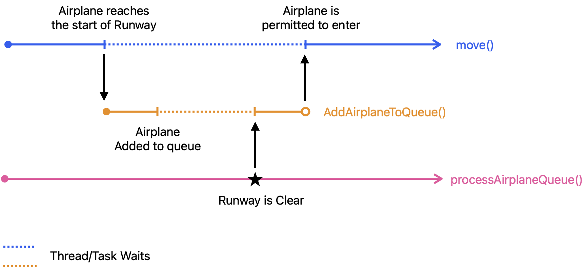
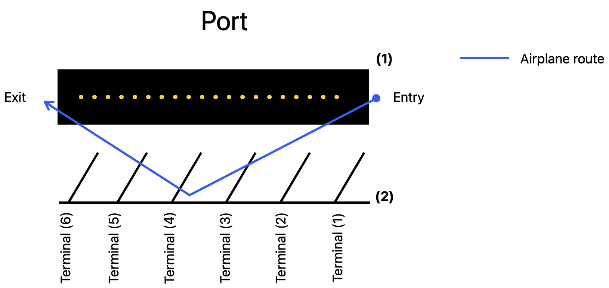
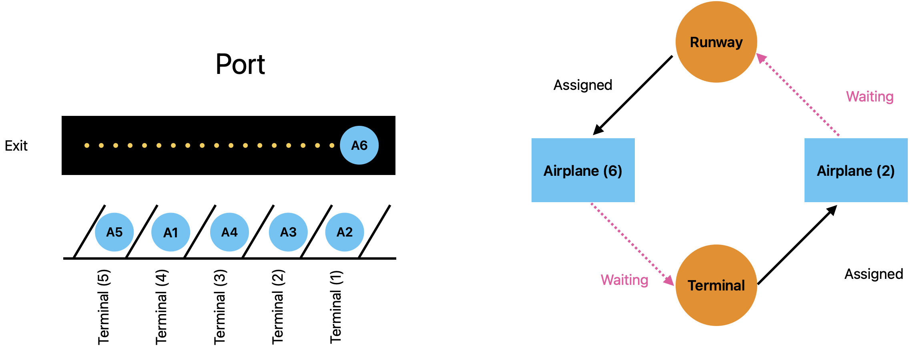

# Airport Runway Traffic Simulation

A simulation of airport runway traffic managed using threads, tasks, mutexes, promises, futures and queues displayed on a GUI. The main idea behind this project is to **permit only ONE airplane in the runway at any given time**. The motivation behind this idea was to ensure that each plane within the premise of an airport is able to safely land, take-off and navigate through it.

## Dependencies

* cmake >= 2.8
* make >= 3.81
* openCV >= 4.1.0
    * Mac: There might be a problem with running the program for the first time and the GUI will not show. The culprit seemed to be opencv installation. Attempt to add opencv to the $PATH variable.
* gcc/g++ >= 5.4
    * Linux: usually pre-installed in most distributions
    * Mac: [Install GCC on mac](https://osxdaily.com/2023/05/02/how-install-gcc-mac/)

## Build Instructions

1. Make a build directory in the top level directory:
```
$ mkdir build && cd build
```
2. Compile it using: 
```
$ cmake .. && make
```
3. Run it within the build directory:
```
$ ./airport_traffic
```


## Roadmap/Improvements

* Easier system to create airport layout and connect runways together.
* Improved GUI:
    * Airplanes are represented as actual airplanes.
    * Clearer runways and taxiways.
    * Better terminals.
    * Dashboard to present stats.
    * Buttons to change values while simulation is running.
* Algorithm improvements:
    * Landing queues:
        * Airplanes LAND then WAIT
        * Airplanes WAIT then LAND
    * Terminal port assignement:
        * Nearest-port
        * Static or pre-defined ports (maybe according to airplane flight)
    * Asynchronous Taxiway: Airplanes can move in and out of terminals whilst other airplanes do the same, without waiting for the Taxiway to be clear.
* When airplanes takeoff and leave the airport they will move in a predefined flight path for a random time until they can land back into the airport.

## How it works
### Main Idea

Breakdown the airport tarmac into a series of interconnected runways or taxiways, and at any given time ensure that only one plane is present on each tract of runway. This guarantees that only one plane is navigating around the runway at any given time and avoids other planes from interfering with each other’s paths. 

<!--  -->
<p align="center">

</p>

### Airplane
The movement of the airplanes within the airport was determined by a state machine that included 4 states: Enter, Wait, Port, Exit. The airplane initially begins in the Wait state as it waits in a queue for the signal to enter the runway. Once it receives said signal, the airplane transitions to the Enter state, where it leaves the queue, enters the runway and travels all the way to opposite end. Once it reaches the end, it transitions to the Exit state, signalling to the runway that it has left it (runway). The cycle restarts when the plane enters another runway. The Port state was a feature I added to facilitate the same behaviour but on terminals (discussed later).

### Runways
As I said before the main purpose of the Runway class was to permit only one plane on the tarmac at a time. To achieve this behaviour there were three problems I needed to solve:
1.	How do I block planes from entering the runway? -> Queues + Future.wait()
2.	How do I know when the runway is clear? -> Runway state variable + Inifnite polling
3.	How do I let the planes in the runway? -> Fulfill the promise

NOTE: In C++ multi-threading the wait() function called on a future will block the thread until it’s corresponding promise calls set_value() which means that data is available and is ready to be retrieved. By doing this the airplane thread is allowed to resume and enters the runway.

<p align="center">

</p>

### Ports
A Port is the section of the airport where the airplanes dock into terminals. In my implementation a single port can have multiple terminals, each accommodating one airplane. As with the runway, only one plane can be travelling into or out a terminal at any given time. Once the plane reaches the terminal or the exit side of the port, then the port’s runway is clear. I designed the program this way to simplify the process of planes moving in and out of their terminals and into the runways. By only having one plane moving at one time, it completely prevents collisions though at the cost of long queueing delays. 

<p align="center">

</p>

Combining the first constraint (one plane for each terminal) and the second constraint (one plane in the runway) I created an interesting problem, what would happen if all the terminals were occupied? The occupation of all the terminal implies that the port runway is clear, hence allowing an airplane to enter (Figure X). However, because there are no ports open, the plane is stuck in the runway. Because of this any plane that wants to exit the terminal can’t because the runway is occupied thereby creating a deadlock. The port runway and the terminal are the shared resources, and the planes are the objects trying to utilise said resource while holding on to the other. 

<p align="center">

</p>

To solve the deadlock there had to be a guarantee that one of the shared resources is freed before it can be obtained, and I chose the runway to be that resource. When a plane arrives at the start of the runway it is placed into a port waiting queue. If the terminals are all occupied the plane must wait in this queue, however if there is an available terminal the plane is transitioned to the runway waiting queue. This queue is exactly as the Runway waiting queue, which only lets a plane in the runway when it is clear. By queuing the airplane in this manner planes waiting to enter the port runway have an available terminal they can go to, thereby resolving the deadlock.

### GUI
The GUI for the simulation was implemented using the Open CV library and it’s drawing classes.
