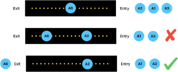

# Airport Runway Traffic Simulation

A simulation of airport runway traffic managed using threads, tasks, mutexes, promises, futures and queues displayed on a GUI. The main idea behind this project is to **permit only ONE airplane in the runway at any given time**. The motivation behind this idea was to ensure that each plane within the premise of an airport is able to safely land, take-off and navigate through it.

## Dependencies

* cmake >= 2.8
* make >= 3.81
* openCV >= 4.1.0
    * Mac: There might be a problem with running the program for the first time and the GUI will not show. The culprit seemed to be opencv installation. Attempt to add opencv to the $PATH variable.
* gcc/g++ >= 5.4
    * Linux: usually pre-installed in most distributions
    * Mac: [Install GCC on mac](https://osxdaily.com/2023/05/02/how-install-gcc-mac/)

## Build Instructions

1. Make a build directory in the top level directory:
```
$ mkdir build && cd build
```
2. Compile it using: 
```
$ cmake .. && make
```
3. Run it within the build directory:
```
$ ./airport_traffic
```


## Roadmap

* Easier system to create airport layout and connect runways together.
* Improved GUI:
    * Airplanes are represented as actual airplanes.
    * Clearer runways and taxiways.
    * Better terminals.
    * Dashboard to present stats.
    * Buttons to change values while simulation is running.
* Algorithm improvements:
    * Landing queues:
        * Airplanes LAND then WAIT
        * Airplanes WAIT then LAND
    * Terminal port assignement:
        * Nearest-port
        * Static or pre-defined ports (maybe according to airplane flight)
    * Asynchronous Taxiway: Airplanes can move in and out of terminals whilst other airplanes do the same, without waiting for the Taxiway to be clear.
* When airplanes takeoff and leave the airport they will move in a predefined flight path for a random time until they can land back into the airport.

## How it works
### Main Idea

Breakdown the airport tarmac into a series of interconnected runways or taxiways, and at any given time ensure that only one plane is present on each tract of runway. This guarantees that only one plane is navigating around the runway at any given time and avoids other planes from interfering with each other’s paths. 

